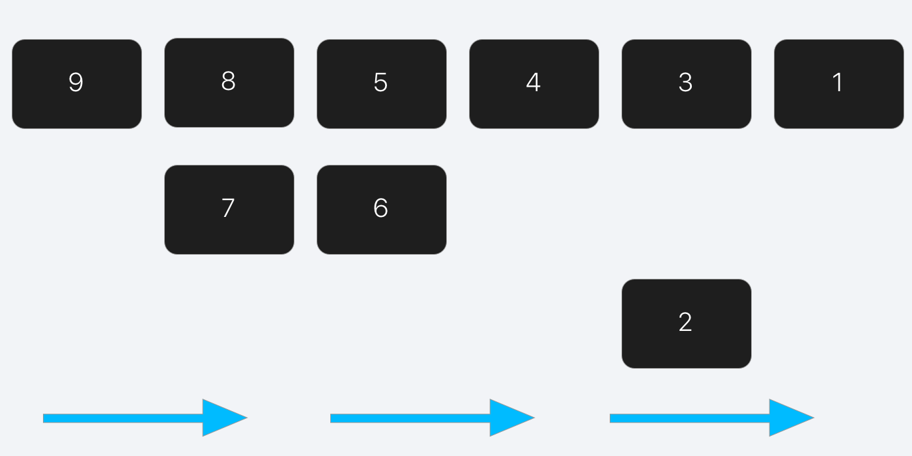
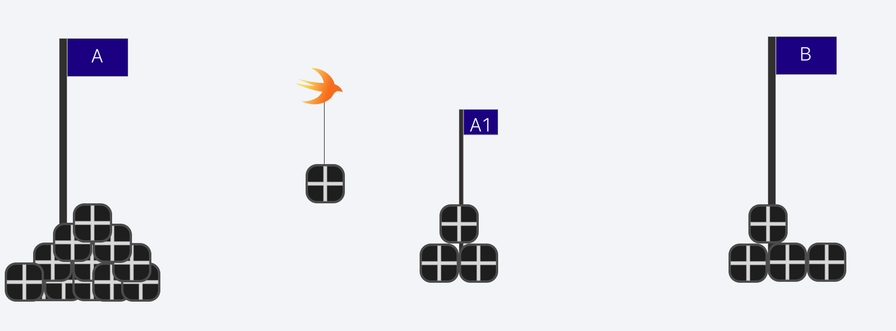
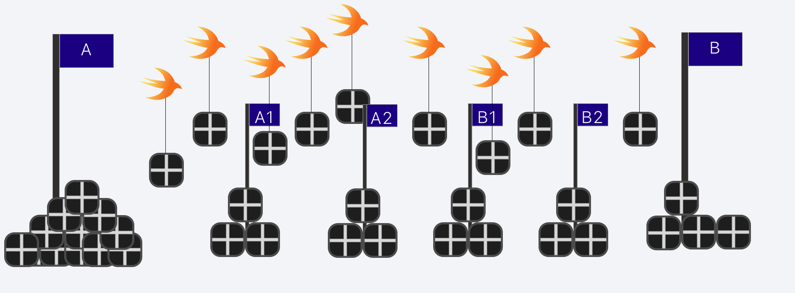
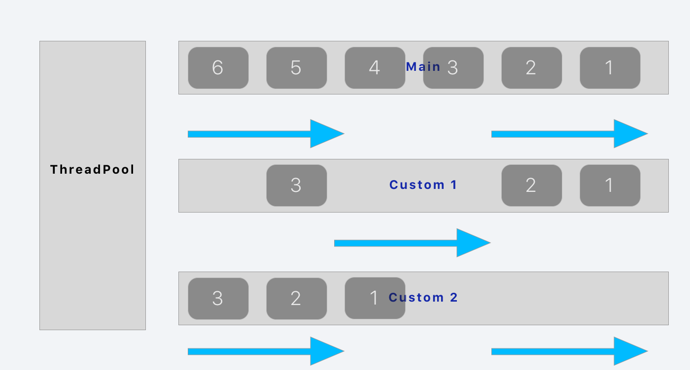

# [Parallel programming with Swift: Basics](https://medium.com/flawless-app-stories/basics-of-parallel-programming-with-swift-93fee8425287)

About a year ago my team started a new project. This time we wanted to use all our learning from prior projects. One of the decisions we’ve made was to make the entire model API asynchronous. This will allow us to change the entire implementation of the model, without affecting the rest of the app. If our app was able to handle asynchronous calls, it didn’t matter whether we were communicating with a backend, the cache or our database. It also enables us to work concurrently.

At the same time, it had some implications. As developers, we had to understand topics like concurrency and parallelism. Otherwise,it would screw us royally. So let’s learn together how to program concurrently.

## Synchronous vs Asynchronous

So what is really the difference between Synchronous and Asynchronous Processing? Imagine we have a list of items. When processing these items synchronously, we start with the first item and finish it before we begin the next. It behaves the same way as a [FIFO Queue](https://en.wikipedia.org/wiki/FIFO_(computing_and_electronics)) (First In, First Out).


Translated into code it means: every statement of a method will be executed in order.

```Swift
func method1() {
  statement1()
  statement2()
  statement3()
  statement4()
}
```

*So basically synchronous means to process 1 item completely at a time.*

In comparison, Asynchronous Processing handles multiple items at the same time. It would e.g. process item1, pause for item2 and then continue and finish with item1.



An example in code would be a simple callback. We can see the code at the end being executed before the callback is processed.

```Swift
func method2() {
  statement1 {
    callback1()
  }
  statement2
}
```

## Concurrency vs Parallelism

Often concurrency and parallelism are used interchangeably (even Wikipedia uses it wrong at some places…). This results in problems, which are easily avoidable if the differences are made clear. Let’s explain it with an example:

Try to imagine, that we have a stack of boxes at position A and we want to transport them to position B. To do so, we can use workers. In a synchronous environment, we could only use 1 worker to do this. He would carry 1 box at a time, all the way from position A to position B.


But let’s imagine we could use multiple workers at the same time. Each of them would take a box and carry it all the way. This would increase our productivity by quite a lot, wouldn’t it? Since we use multiple workers, it would increase by the same factor as the number of workers we have. As long as at least 2 workers carry boxes at the same time, they do it in parallel.

*Parallelism is about executing work at the same time.*

But what happens, if we have just 1 worker and might be able to use more than this? We should consider having multiple boxes in the processing state. This is what concurrency is about. It can be seen as dividing the distance from A to B in multiple steps. The worker could carry a box from A to the halfway point of the whole distance and then get back to A to grab the next box. Using multiple workers we could make them all carry the boxes a different distance. This way we process the boxes asynchronously. In case we have multiple workers, we process the boxes in parallel.



So the difference between parallelism and concurrency is simple. Parallelism is about doing work at the same time. Concurrency is about the option to do work at the same time. It doesn’t have to be parallel, but it could be. Most of our computers and mobile devices can work in parallel (due to the number of cores) but every software you have definitely works concurrently.



# Mechanisms for Concurrency

Every Operating System provides different tools to use concurrency. In iOS, we have default tools like processes and threads, but due to its history with Objective-C, there are also Dispatch Queues.

## Process

Processes are the instances of your app. It contains everything needed to execute your app, this includes your stack, heap, and all other resources.

Despite iOS being a multitasking OS, it does not support multiple processes for one app. Thus you only have one process. Looking at macOS it is a little bit different. You can use [the Process class](https://developer.apple.com/documentation/foundation/process) to spawn new child processes. These are independent of their parent process but contain all the information, the parent had at the time of the child process’s creation. In case you are working on macOS, here is the code to create and execute a process:

```Swift
let task = Process()
task.launchPath = "/bin/sh" //executable you want to run
task.arguments = arguments //here is the information you want to pass
task.terminationHandler = {
  // do here something in case the process terminates
}

task.launch()
```

## Thread

A [thread](https://developer.apple.com/documentation/foundation/thread) is some kind of lightweight process. Compared to processes, threads share their memory with their parent process. This can result in problems, such as having two threads changing a resource (e.g. a variable) at the same time. As a result we would be getting incoherent results, when reading it again. Threads are a limited resource on iOS (or any POSIX compliant system). It’s limited to 64 threads at the same time for one process. Which is a lot, but there are reasons to go above these. You can create and execute a thread this way:

```Swift
class CustomThread: Thread {
  override func main() {
    do_something
  }
}

let customThread = CustomThread()
customThread.start()
```

## Dispatch Queues

Since we only have one process and threads are limited to 64, there have to be other options to run code concurrent. Apple’s solution is dispatch queues. You can add tasks to a dispatch queue and expect it to be executed at some point. There are different types of dispatch queues. One is the SerialQueue. In this type everything will be processed in the same order as it was added to the queue. The other is the ConcurrentQueue. As the name suggests, tasks can be executed concurrently within this queue.

This isn’t really concurrent yet, right? Especially when looking into SerialQueues, we didn’t win anything. And ConcurrentQueues don’t make anything easier. We do have threads, so what’s the point?

Let’s consider what happens if we have multiple queues. We could just run a queue on a thread and then whenever we schedule a task, add this into one of the queues. Adding some brain power, we could even distribute the incoming tasks for priority and current workload, thus optimizing our system resources.



Apple’s implementation of the above is called Grand Central Dispatch (or GCD for short). How is this handled in iOS?

```Swift
DispatchQueue.main.async {
    // execute async on main thread
}
```

The great advantage of Dispatch Queues is, that it changes your mental model of concurrent programming. Instead of thinking in threads, you consider it as blocks of work pushed onto different queues, which is a lot easier.

## Operation Queues

Cocoa’s high-level abstraction of GCD is Operation Queues. Instead of a block of discrete units of work you create operations. These will be pushed onto a queue and then executed at the correct order. There are different types of queues: the main queue, which executes on the main thread and the custom queues, which does not execute on the main thread.

```Swift
let operationQueue: OperationQueue = OperationQueue()
operationQueue.addOperations([operation1], waitUntilFinished: false)
```

Creating an operation can also be done in multiple ways. Either you can create an Operation with a block, or subclass. In case you subclass, don’t forget to call finish, otherwise, the operation will never stop.

```Swift
class CustomOperation: Operation {
    override func main() {
        guard isCancelled == false else {
            finish(true)
            return
        }
        
        // Do something
        
        finish(true)
    }
}
```

A nice advantage about operations is that you can use dependencies. Having operation A depends on operation B results in B not being executed before A.

```Swift
operation2.addDependency(operation1) //execute operation1 before operation2
```

## Run Loops

[Run Loops](https://developer.apple.com/documentation/foundation/runloop) are similar to Queues. The system runs through all the work in the queue and then starts over at the beginning. E.g. Screen redraw, is done by a Run Loop. One thing to note is, they aren’t really methods to create concurrency. Rather they are tied to a single thread. Still, they enable you to run code asynchronously, while alleviating you of the burden to consider concurrency. Not every thread has a Run Loop, instead, it will be created the first time it’s requested.

While using Run Loops you need to consider that they have different modes. For example, when you scroll on your device, the Run Loop of the Main thread changes and delays all the incoming events. As soon as your device stops scrolling, the Run Loop will return to its default state and all the events will be processed. A Run Loop always needs an input source, otherwise, everything executed on it will immediately exit. So don’t forget about it.

## Lightweight Routines

There is a new idea of having really lightweight threads. These are not yet implemented in Swift but there is [a proposal](https://github.com/apple/swift/blob/c760f6dfbf0179e9aff90f7bf7375f3af5331318/docs/proposals/Concurrency.rst) at Swift Evolution (see Streams).

# Options to control Concurrency

We looked into all the different elements provided by the Operating System, which can be used to create concurrent programs. But as mentioned above, it can create a lot of problems. The easiest problem to create and at the same time the hardest to identify is having multiple concurrent tasks accessing the same resource. If there is no mechanism to handle these accesses, it can result in one task writing one value. At the same time a second task would be writing a different value. When the first task reads the value again it would expect the value it has written itself, not the value of the other task. So the default way is to lock access to a resource and prevent other threads to access it as long as it is locked.

## Priority Inversion

To understand the different locking mechanisms we also need to understand thread priorities. As you can guess, threads can be executed with higher and lower priorities, meaning everything on a higher priority will be executed earlier than lower priorities. When a lower priority thread is locking a resource a thread with higher priority wants to access, suddenly the thread with higher priority has to wait, thus (kind of) increasing the priority on the lower priority thread. This is called Priority Inversion and can result in the higher priority thread starving to death, as it never gets executed. So you definitely want to avoid it.

Imagine having two high priority threads (1 & 2) and a low priority thread (3). If 3 blocks a resource 1 wants to access, 1 will have to wait. Since 2 has a higher priority, all its work will be done first. In cases, where this doesn’t end, thread 3 will not be executed and thus thread 1 will be blocked indefinitely.


## Priority Inheritance

A solution to Priority Inversion is Priority Inheritance. In this case, thread 1 would surrender it’s priority to thread 3, as long as it is blocked. So thread 3 and 2 have a high priority and get both executed (depending on the OS). As soon as 3 unlocks the resource, the high priority is back to thread 1 and it will continue with its original work.


## Atomic

Atomic contains the same idea as a transaction in a database context. You want to write a value all at once behaving as one operation. Apps compiled for 32 bit, can have quite the odd behavior, when using *int64_t* and not having it atomic. Why? Let’s look into detail what happens:

```
int64_t x = 0Thread1:
x = 0xFFFFThread2:
x = 0xEEDD
```

Having a non-atomic operation can result in the first thread starting to write into x. But since we are working on a 32bit Operating System, we have to separate the value we write into x into two batches of *0xFF*.

When Thread2 decides to write into x at the same time, it can happen to schedule the operations in the following order:

```
Thread1: part1
Thread2: part1
Thread2: part2
Thread1: part2
```

In the end we would get:

```
x == 0xEEFF
```

which is neither *0xFFFF* nor *0xEEDD*.

Using atomic we create a single transaction which would result in the following behavior:

```
Thread1: part1
Thread1: part2
Thread2: part1
Thread2: part2
```

As a result, x contains the value Thread2 set. Swift itself does not have atomic implemented. On Swift evolution is [a proposal](https://github.com/apple/swift-evolution/blob/master/proposals/0030-property-behavior-decls.md) to add it, but at the moment, you’ll have to implement it yourself.

## Lock

Locks are a simple way to prevent multiple threads to access a resource. A thread first checks, whether it can enter the protected part or not. If it can enter, it will lock the protected part and proceed. As soon as it exits, it will unlock. If on entering the thread encounters a locked part, it will wait. This is normally done by sleeping and regularly waking up, to check whether it is still locked or not.

In iOS, this can be done with [NSLock](https://developer.apple.com/documentation/foundation/nslock). But be aware, when unlocking, it has to be the same thread, as the one that locked.

```Swift
let lock = NSLock()
lock.lock()
//do something
lock.unlock()
```

There are also other types of locks, such as recursive locks. With these, a thread can lock a resource multiple times and has to release it as often as it locked. During this whole time, other threads are excluded.

Another type is the read-write lock. This is useful for large-scale apps when a lot of threads read from a resource and only write sometimes. As long as no thread is writing to the resource all threads can access it. As soon as a thread wants to write to it, it will lock the resource for all threads. They can’t read until the lock is released.

On the process level, there is also a distributed lock. The difference is, in case the process is blocked, it just reports it to the process and the process can decide how to handle this situation.

## Spinlock

A lock consists of multiple operations which send threads asleep, till it’s the threads turn again. This results in context changes for the CPU (pushing registers etc. to store the threads state). These changes need a lot of computation time. If you have really small operations you want to protect, you can use spinlocks. The basic idea is to make the waiting thread poll the lock, as long as it is waiting. This requires more resources, than a sleeping thread. At the same time, it circumvents the context changes and is thus faster on small operations.

This sounds nice in theory, but iOS is as always different. iOS has a concept called Quality of Service (QoS). With QoS, it can happen that low priority threads will not be executed at all. Having a spinlock set on such a thread and a higher thread trying to access it, will result in the higher thread starving the lower thread, thus not unlocking the required resource and blocking itself. As a result, spinlocks are [illegal on iOS](https://lists.swift.org/pipermail/swift-dev/Week-of-Mon-20151214/000321.html).

## Mutex

A mutex is like a lock. The difference is, it can be across processes and not only across threads. Sadly you will have to implement your own Mutex since Swift doesn’t have one. This can be done using C’s pthread_mutex.

```Swift
var m = pthread_mutex_t()
pthread_mutex_lock(&m)
// do something
pthread_mutex_unlock(&m)
```

## Semaphore

A semaphore is a data structure to support mutual exclusivity in thread synchronization. It consists of a counter, a FIFO queue and the methods wait() and signal().

Every time a thread wants to enter a protected part, it will call wait() on the semaphore. The semaphore will decrease it’s counter and as long as it is not 0, will allow the thread to continue. Otherwise, it will store the thread in its queue. Whenever a thread exits a protected part, it will call signal() to inform the semaphore. The semaphore will first check, whether there is a thread waiting in its queue. If this is the case, it will wake the thread, so it can continue. If not, it will increase its counter again.

In iOS, we can use [DispatchSemaphores](https://developer.apple.com/documentation/dispatch/dispatchsemaphore) to achieve this behavior. It’s preferred to use these over the default Semaphores, as they only go down to kernel level in case it really needs to. Otherwise, it behaves a lot faster.

```Swift
let s = DispatchSemaphore(value: 1)
_ = s.wait(timeout: DispatchTime.distantFuture)
// do something
s.signal()
```

One might consider a binary semaphore (a semaphore with counter value 1) to be the same as a mutex, but while a mutex is about locking mechanism, a semaphore is a signaling mechanism. This doesn’t really help, so where is the difference?

A locking mechanism is about protecting and managing access to a resource. So it prevents multiple threads to access one resource at the same time. A signaling system is more like calling “Hey I’m done! Carry on!”. For example, if you are listening to music on your mobile phone and a call comes in, the shared resource (headphones) will be acquired by the phone. When it is done, it will inform your mp3 player via a signal to continue. This is the situation to consider a semaphore over a mutex.

So where is the catch? Imagine you have a low priority thread (1) which is within the protected area, and you have a high priority thread (2) which just called wait() on the semaphore. 2 is sleeping and waiting for the semaphore to wake it up. Now we have a thread (3) which has a higher priority than 1. This thread in combination with QoS prevents 1 to signal the semaphore and thus starves both other threads. So the semaphores within iOS do not have Priority Inheritance.

## Synchronized

In Objective-C, there is also the option to use @synchronized. This is an easy way to create a mutex. Since Swift doesn’t have it, we have to look a little bit deeper. You’ll find out, @synchronized just calls objc_sync_enter.

```Swift
let lock = self

objc_sync_enter(lock)
closure()
objc_sync_exit(lock)
```

Since I’ve seen this question multiple times on the internet let’s answer it too. As far as I know, this is not a private method, so using it won’t exclude you from the AppStore.

## Concurrency Queues Dispatching

Since there is no mutex in Swift and synchronized has also been removed, it became the golden Standard for Swift developers to use DispatchQueues. When using it synchronously, you have the same behavior as a mutex, as all the actions are queued on the same queue. This prevents it from being executed simultaneously.


The disadvantage is it’s time consumption as it has to allocate and change contexts a lot. This is irrelevant if your app doesn’t need any high computational power, but in case you experience any frame drops, you might want to consider a different solution (e.g. Mutex).

## Dispatch Barriers

If you are using GCD, there are more options to synchronize your code. One of these are Dispatch Barriers. With these, we can create blocks of protected parts, which need to be executed together. We can also control in which order asynchronous code executes. It sounds odd to do this, but imagine you have a long running task to do, which can be split into parts. These parts need to be run in order but can again be split into smaller chunks. These smaller chunks of a part can be run asynchronously. Dispatch Barriers can now be used to synchronize the larger parts, while the chunks can run wild.

## Trampoline

A trampoline is not really a mechanism provided by the OS. Instead, it is a pattern you can use to ensure a method is called on the correct thread. The idea is simple, the method checks at the beginning, whether it is on the correct thread, otherwise, it calls itself on the correct thread and returns. Sometimes you need to use the above locking mechanisms, to implement a waiting procedure. This is only the case, whenever the method called returns a value. Otherwise, you can simply return.

```Swift
func executeOnMain() {
  if !Thread.isMainThread {
    DispatchQueue.main.async(execute: {() -> Void in
      executeOnMain()
    })
    return
  }
  
  // do something
}
```

Don’t use this pattern too often. It’s tempting to do so and ensure your thread, but at the same time, it confuses your coworkers. They might not understand why you are changing threads everywhere. At some point, it becomes clutter and takes away the time to reason about your code.

# Conclusion

Wow, this was quite a heavy post. There are so many options to do concurrent programming and this posts just scratches the surface. At the same time, there are so many mechanisms to do so and a lot of cases to consider. I’m probably annoying everyone at work, whenever I talk about threads, but they are important and slowly my coworkers start to agree. Just today I had to fix a bug where operations accessed an array asynchronous and as we’ve learned Swift doesn’t support atomic actions. Guess what? It ended up in a crash. This might not have happened if all of us would know more about concurrency, but truth be told, I didn’t see it at first either.

Knowing your tools is the best advice I can give you. With the above post, I hope you found a starting point for concurrency and also a way to control the chaos which will manifest as soon as you dive deeper. Good Luck!

P.S.: There is more to come: An in-depth look into Operations and other higher level tools to battle concurrency!